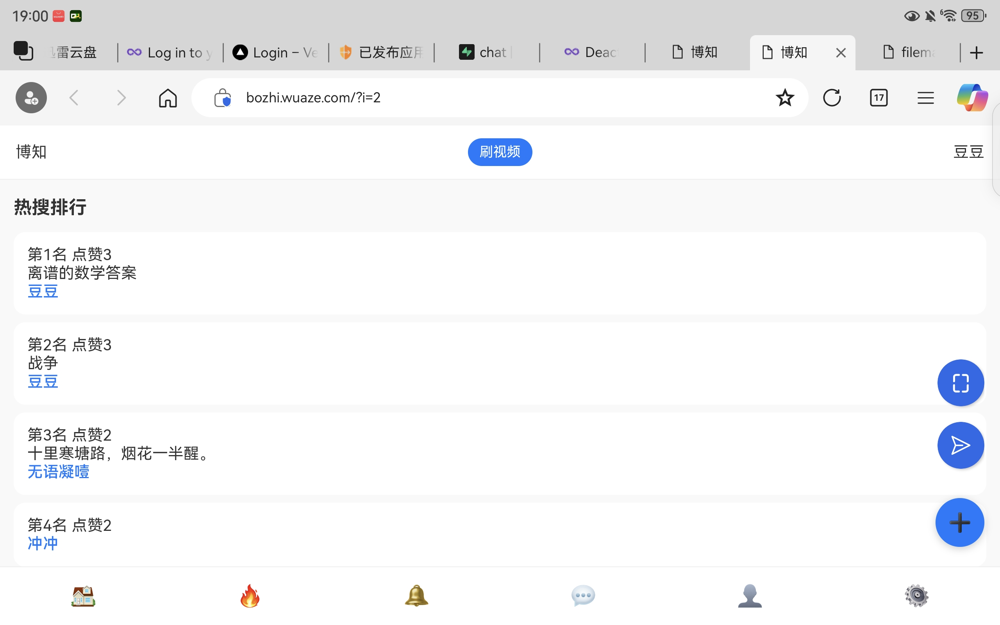
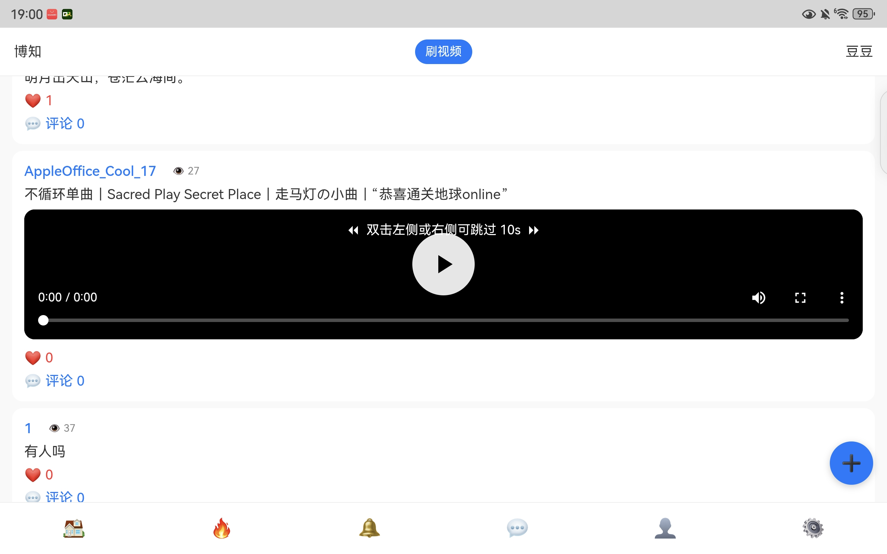
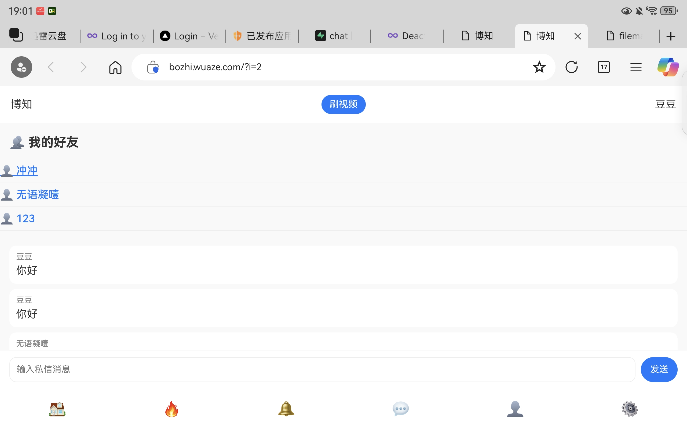
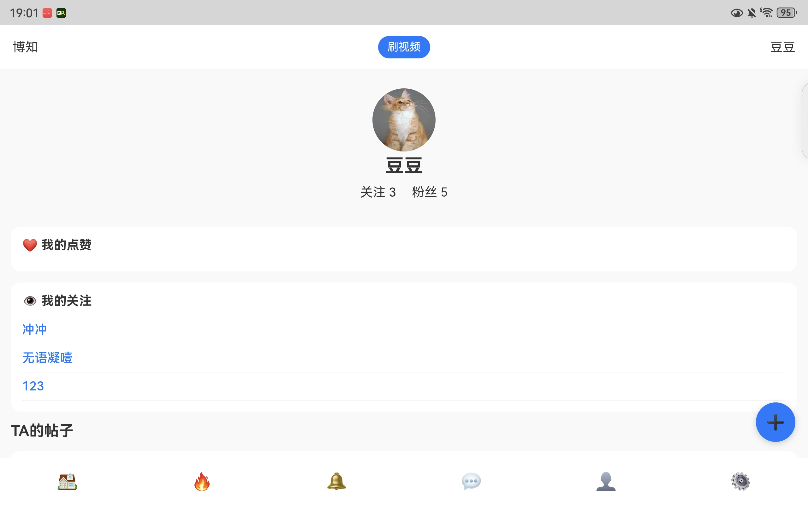
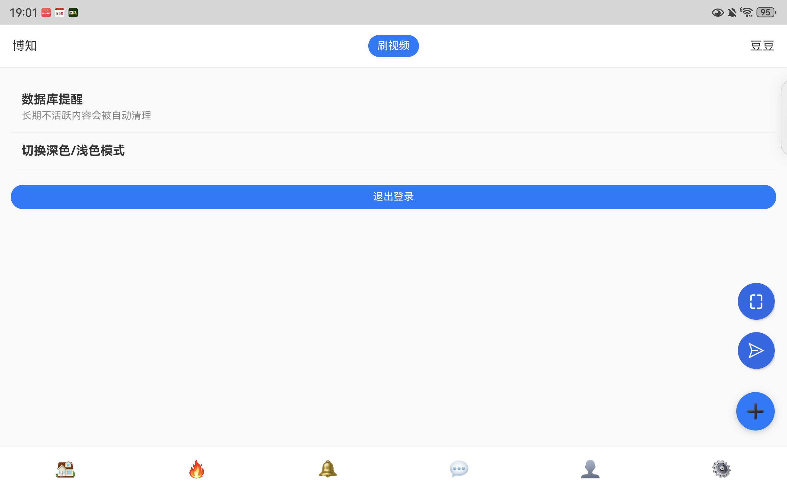
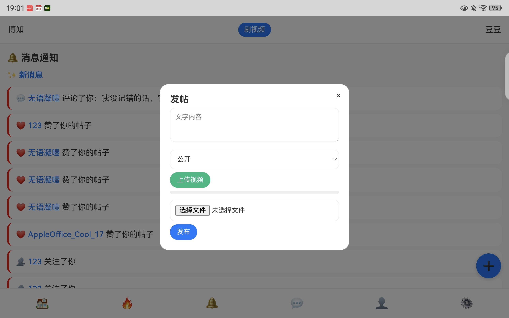

# 博知 (Bozhi)  

Bozhi is an open-source social platform where users can share posts, interact with others, and stay updated with trending topics
The interface is in Chinese, so foreign users may need translation support.

## Features
- Personal profile management
- Follow/follower system
- Likes and comments notifications
- Friend list
- Trending topics list
- Post creation with text and media support
- Search and discover content

## Screenshots

